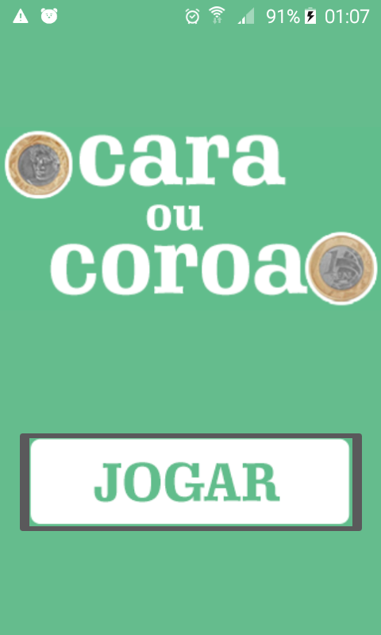
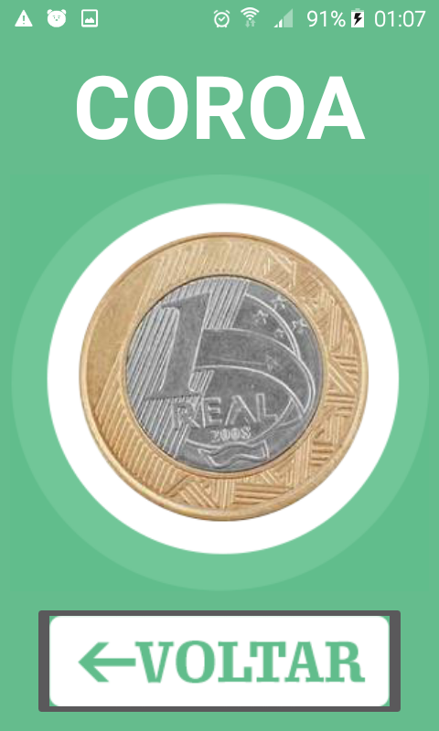

<h1  align="center">Cara ou Coroa</h1>

  

Aplicativo simples feito para a disciplina de Desenvolvimente para dispositivos moveis - Android.

Um aplicativo em que será mostrado de maneira aleatória a face de uma moeda, podendo ela ser cara ou coroa.
  

<b> * Topicos estudados *

 - Navegação e passagem de dados entre activitys  

<h3> Telas do aplicativo em um celular Galaxy J1 Mini</h3>

 

